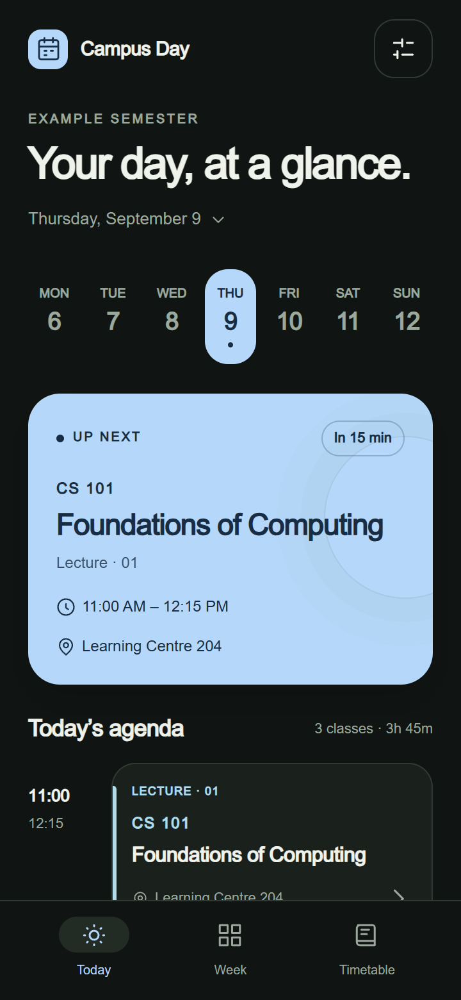
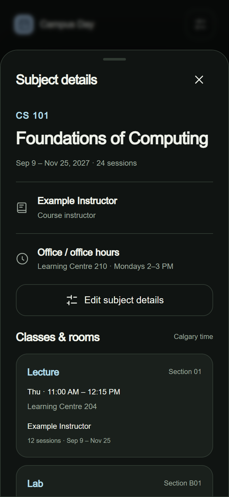
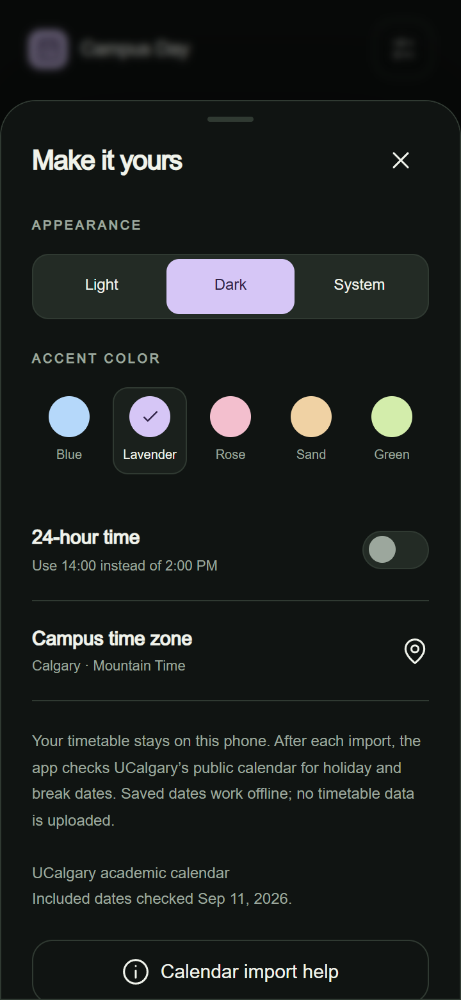

# Campus Day

An offline Android timetable for university life. Import an `.ics` calendar, see what comes next, and keep rooms and course details close at hand.

Independent project; not affiliated with or endorsed by the University of Calgary.

<p align="center">
  
  
  
</p>

_Screenshots show the actual interface in a mobile browser test, using fictional data from [demo.ics](examples/demo.ics). No student timetable is included._

## Install

Download **Campus-Day-1.1.apk** from [Releases](https://github.com/Unitron07/UofC-Schedule-App/releases). Open it on your phone and allow installation from the app used to open the download when Android asks. Version 1.0 is available as a historical release.

1. In your own browser, sign in to the university portal and download your semester's calendar.
2. Open Campus Day, tap **Import timetable**, and choose the `.ics` file.
3. Review the import. Optionally add course codes, full names, instructors, office hours, and notes—or choose **Skip for now**.
4. Open **Timetable → a subject → Edit subject details** whenever you want to update that information.

Import a fresh calendar when the university changes your schedule. A new import replaces meetings; saved details are retained when the course identity matches. There is no automatic portal login or background synchronization.

## Features

- Daily agenda, next-class countdown, gaps, class details, and a weekly overview.
- Searchable subjects with rooms, meeting types, sections, instructors, and editable notes.
- Lecture, tutorial, and lab inference for supported UCalgary section identifiers; editable for other formats.
- Blue, lavender, rose, sand, and green accents; light, dark, or system appearance; 12/24-hour time.
- Calendar import through Android's file picker, Open with, or Share where supported.
- Calgary time handling, recurrence, exceptions, cancellations, and daylight-saving transitions.
- No account, analytics, network permission, or university password stored in the app.

Course codes are extracted when present in the event title. Missing names and instructors can be entered manually. There is no embedded student enrollment, instructor directory, or catalog lookup. Online courses absent from the calendar are not automatically added.

## Build from a fresh clone

Install **JDK 17**, Android SDK **Platform 35**, and Android SDK **Build Tools 35.0.0**. Android Studio can install these SDK components. Set `ANDROID_HOME` to your SDK directory, or use an untracked `local.properties` file containing `sdk.dir=...`.

```sh
git clone https://github.com/Unitron07/UofC-Schedule-App.git
cd UofC-Schedule-App
./gradlew assembleDebug
```

On Windows, run `gradlew.bat assembleDebug`. The APK is written to `app/build/outputs/apk/debug/app-debug.apk`. The checked-in wrapper downloads Gradle 8.9 and verifies its SHA-256 checksum; the Android Gradle plugin is pinned to 8.7.3. Internet access is needed for the first build's development dependencies, but not to use the app.

Debug builds use your local Android debug signing key. Release signing keys are deliberately excluded. A build signed with a different key cannot update an installed release; uninstalling first removes its local data. The two published APKs use the same project signing certificate.

For a Windows command-line build without Gradle:

```powershell
./build-apk.ps1 -JavaHome $env:JAVA_HOME `
  -AndroidJar "$env:ANDROID_HOME/platforms/android-35/android.jar" `
  -BuildTools "$env:ANDROID_HOME/build-tools/35.0.0" `
  -BuildDirectory ./build/manual -OutputApk ./build/Campus-Day.apk
```

This creates a local development keystore under the ignored build directory. Keep any signing key private and backed up for future update compatibility.

## Test and develop

Install Node.js 22 or later, then:

```sh
npm ci
npm test
npx playwright install chromium
npm run test:ui
npm run format:check
```

Browser tests use the fictional fixture and generate screenshots in ignored `test-output/`. `CHROME_PATH` optionally selects an existing Chrome executable; `TEST_OUTPUT` changes the screenshot directory. Browser tests cover the interface, not Android's native document picker. Test native import and system insets on a device when changing the Java host.

| Location                                               | Purpose                                                        |
| ------------------------------------------------------ | -------------------------------------------------------------- |
| `app/src/main/java/ca/campusday/app/MainActivity.java` | Android host, file access, local WebView origin, system insets |
| `app/src/main/assets/calendar.js`                      | ICS parsing, recurrence, Calgary time                          |
| `app/src/main/assets/courses.js`                       | Generic course identity and user-provided metadata             |
| `app/src/main/assets/app.js`, `subjects.js`            | Views, import flow, preferences, subject editor                |
| `app/src/main/assets/style.css`                        | Responsive interface and appearance palettes                   |
| `tests/`, `examples/`                                  | Portable checks and fictional calendar                         |
| `.github/workflows/ci.yml`                             | Formatting, parser/UI checks, Android build                    |

See [CONTRIBUTING.md](CONTRIBUTING.md), [PRIVACY.md](PRIVACY.md), and [CHANGELOG.md](CHANGELOG.md). Tags `v1.0.0` and `v1.1.0` retain source for each APK generation.

## Third-party component

Bundled, unmodified ICAL.js 2.2.1 is licensed under MPL-2.0. Its license is included in [ICAL-LICENSE.txt](ICAL-LICENSE.txt); source is available from the [ICAL.js project](https://github.com/kewisch/ical.js/tree/v2.2.1). No runtime CDN or external font is required.
